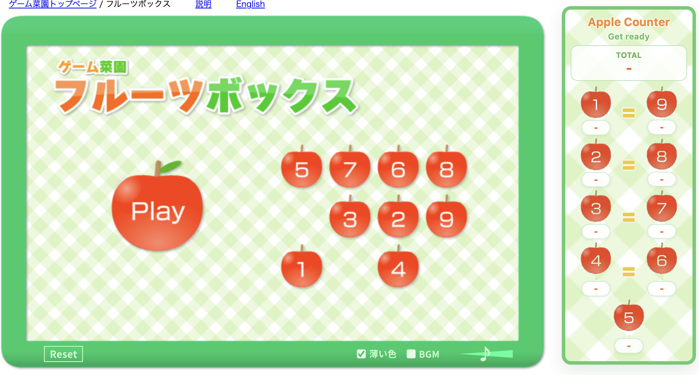
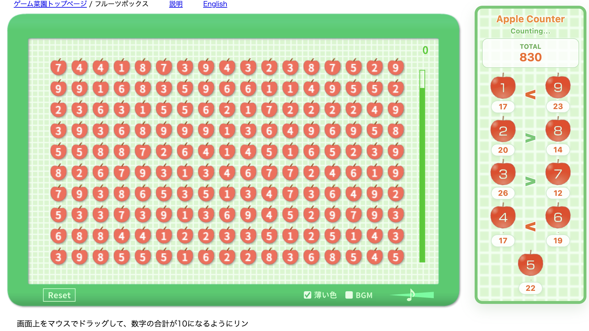

# Apple Game Counter

`https://www.gamesaien.com/game/fruit_box_a/` 에서 현재 사과들의 총합과 숫자 `1~9` 각각의 개수를 실시간으로 보여주는 크롬 확장프로그램입니다.

## Screenshots

### Version 0.1.0

#### Start Screen

#### Live Board

#### End Screen

### Version 0.2.0

#### Start Screen

#### Live Board

## How It Works

이 확장은 OCR을 사용하지 않습니다.

대신 게임 페이지 내부의 `createjs` 런타임을 직접 읽습니다. 콘텐츠 스크립트가 페이지 컨텍스트에 `page-bridge.js`를 주입하고, 그 스크립트가 보드 객체 트리에서 현재 숫자 상태를 수집합니다.

현재 수집 흐름은 다음과 같습니다.

1. `exportRoot` 아래 보드 컨테이너 `mg` 탐색
2. 각 셀 내부의 `mks -> mksa -> txNu` 값 읽기
3. 살아 있는 셀만 대상으로 숫자 집계
4. 값이 바뀌었을 때만 오버레이 다시 렌더링

즉, 화면을 이미지처럼 읽는 방식이 아니라 게임이 이미 가지고 있는 숫자 상태를 직접 가져오는 구조입니다.

오버레이는 우측 상단의 작은 고정 패널입니다.

## Project Files

- `manifest.json`: 크롬 확장 설정
- `content-script.js`: 오버레이 UI 생성, 페이지 브리지 주입
- `content.css`: 오버레이 스타일
- `page-bridge.js`: 게임 런타임에서 숫자 수집 및 집계
- `assets/`: 패턴, 라벨, 아이콘 등 정적 에셋
- `docs/screenshots/`: README용 스크린샷
