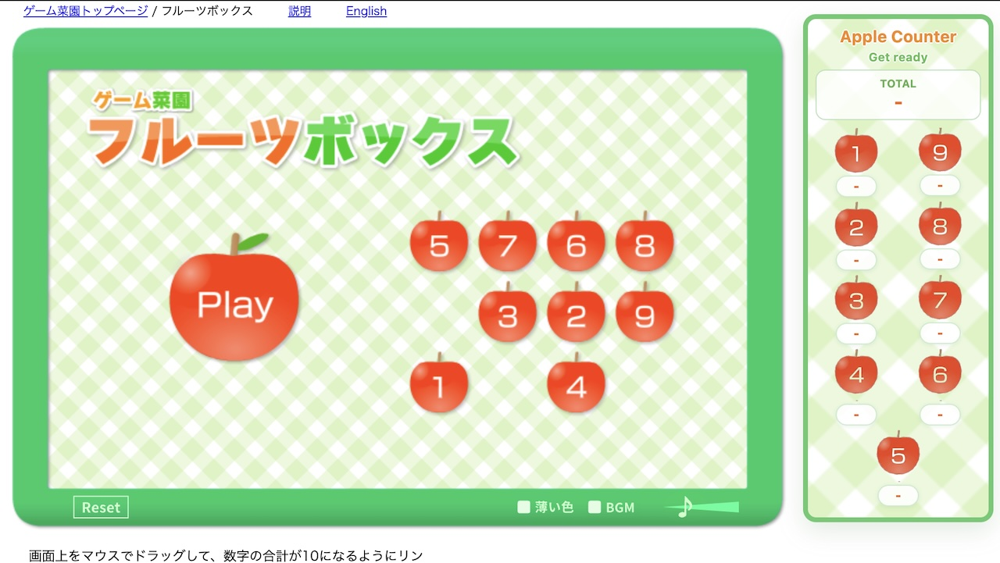
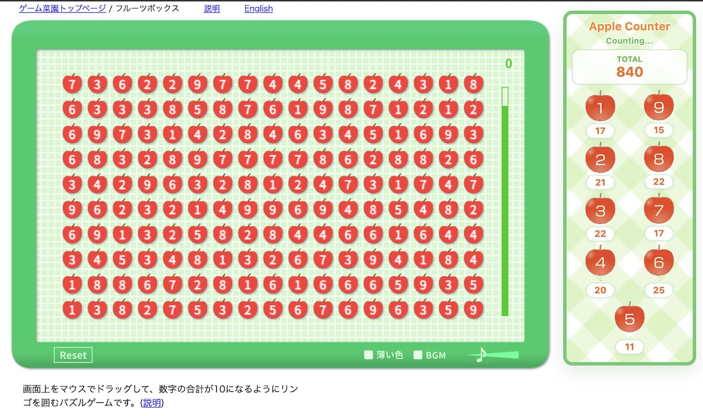
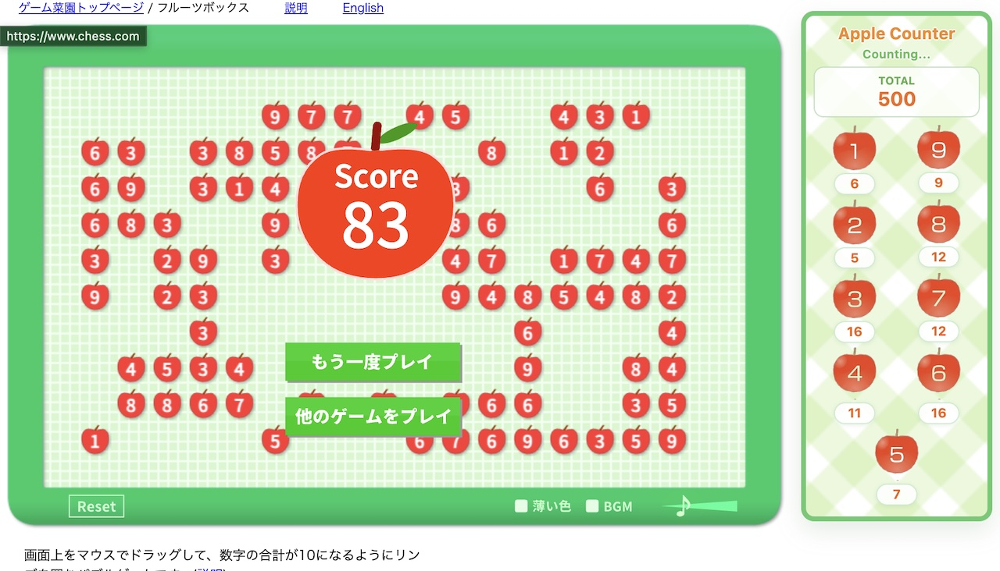

# Apple Game Counter

`https://www.gamesaien.com/game/fruit_box_a/` 에서 현재 사과들의 총합과 숫자 `1~9` 각각의 개수를 실시간으로 보여주는 크롬 확장프로그램입니다.

## Screenshots

### Start Screen



### Live Board



### End Screen



## What It Shows

- 현재 보드 전체 합계
- 숫자 `1~9` 각각의 남은 개수

숫자 배치는 비교하기 쉽게 아래 구조를 사용합니다.

```text
1 9
2 8
3 7
4 6
 5
```

## How It Works

이 확장은 OCR을 사용하지 않습니다.

대신 게임 페이지 내부의 `createjs` 런타임을 직접 읽습니다. 콘텐츠 스크립트가 페이지 컨텍스트에 `page-bridge.js`를 주입하고, 그 스크립트가 보드 객체 트리에서 현재 숫자 상태를 수집합니다.

현재 수집 흐름은 다음과 같습니다.

1. `exportRoot` 아래 보드 컨테이너 `mg` 탐색
2. 각 셀 내부의 `mks -> mksa -> txNu` 값 읽기
3. 살아 있는 셀만 대상으로 숫자 집계
4. 값이 바뀌었을 때만 오버레이 다시 렌더링

즉, 화면을 이미지처럼 읽는 방식이 아니라 게임이 이미 가지고 있는 숫자 상태를 직접 가져오는 구조입니다.

## Update Timing

드래그 중간 상태는 바로 반영하지 않습니다.

입력이 눌려 있는 동안에는 오버레이 갱신을 잠시 보류하고, 입력이 끝난 뒤 짧은 안정화 시간을 거쳐 확정된 상태만 표시합니다. 그래서 드래그 도중 숫자가 흔들리지 않고, 실제로 사과가 제거된 뒤 수치가 바뀌도록 맞춰져 있습니다.

## UI

오버레이는 우측 상단의 작은 고정 패널입니다.

디자인 요소:

- 게임 원본과 비슷한 체크 패턴 배경
- 초록색 테두리 프레임
- 사과 라벨 이미지 사용
- `pointer-events: none` 으로 게임 입력 방해 방지

## Project Files

- `manifest.json`: 크롬 확장 설정
- `content-script.js`: 오버레이 UI 생성, 페이지 브리지 주입
- `content.css`: 오버레이 스타일
- `page-bridge.js`: 게임 런타임에서 숫자 수집 및 집계
- `assets/`: 패턴, 라벨, 아이콘 등 정적 에셋
- `docs/screenshots/`: README용 스크린샷

## Install

1. 크롬에서 `chrome://extensions` 를 엽니다.
2. `개발자 모드`를 켭니다.
3. `압축해제된 확장 프로그램을 로드합니다`를 클릭합니다.
4. 이 프로젝트 폴더를 선택합니다.
5. 게임 페이지를 새로고침합니다.

## Scope

포함:

- `Fruit Box A` 단일 페이지 지원
- 실시간 합계 표시
- 숫자별 개수 표시
- 게임 테마에 맞춘 오버레이 UI

포함하지 않음:

- OCR
- 자동 플레이
- 최적 수 추천
- 팝업/옵션 페이지
- 다른 게임 페이지 지원

## Notes

게임 페이지 내부 구조가 크게 바뀌면 `page-bridge.js`의 수집 로직도 함께 수정해야 합니다.
